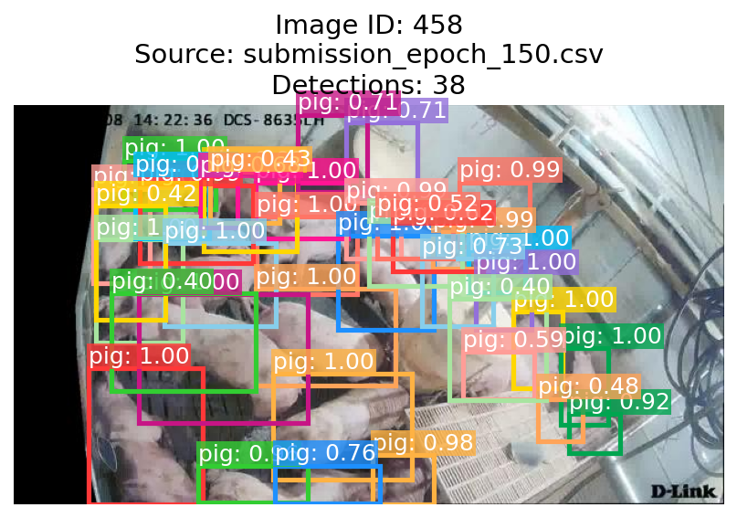

# Object Detection for Group-hosed Swine (2025 CVPDL HW1)

<p align="center">
  
  <br>
  <em>Swine Detection Resoult</em>
</p>

This project is a comprehensive solution for the "Object Detection for Group-hosed Swine" assignment in the NTU CVPDL course. It implements a high-performance training and inference pipeline using a Faster R-CNN model with a ConvNeXt backbone, incorporating modern deep learning best practices for achieving high mAP scores.

The entire workflow is managed by a central runner script, `main.py`, which automates data pre-processing, training, and prediction generation.

## Key Features

- **Powerful Model Architecture**: Utilizes a Faster R-CNN detector with a pre-trained **ConvNeXt** backbone and Feature Pyramid Network (FPN) for robust feature extraction.
- **Automated "One-Key" Workflow**: The `main.py` script serves as a single entry point to run the entire pipeline, from optional data clustering to training and final submission file generation.
- **Advanced Training Strategies**:
  - **Mixed-Precision Training (AMP)**: Leverages `torch.amp` to accelerate training and reduce GPU memory usage.
  - **Gradient Accumulation**: Enables training with large effective batch sizes even on memory-constrained GPUs.
  - **Advanced LR Scheduling**: Implements a warm-up phase followed by a Cosine Annealing schedule to stabilize training and improve convergence.
- **Smart Data Handling**:
  - **Automatic Data Clustering**: The `main.py` script can automatically run a pre-processing script (`scripts/build_clusters.py`) to cluster images by scene type (e.g., daytime, infrared).
  - **Stratified Splitting**: Uses the generated clusters to perform a stratified train/validation split, ensuring the validation set is representative.
  - **Cluster-Aware Augmentations**: Applies different, optimized data augmentation pipelines based on the image cluster, improving model robustness.
- **Flexible Post-processing**: Supports standard NMS and advanced **Soft-NMS** during inference, configurable via command-line arguments.
- **Reproducibility**: Enforces strict seeding across all components (PyTorch, NumPy, DataLoaders) to ensure experiments are fully reproducible.
- **Advanced Visualization Toolkit**: Includes a visualize.py script to inspect model predictions, featuring modes to view images with the most/least detections, random samples, or specific IDs for in-depth error analysis.

## Project Structure

```
.
├── data/                  # Placeholder for dataset files
│   ├── train/
│   │   ├── img/
│   │   └── gt.txt
│   └── test/
│       └── img/
├── models/                # Output directory for models, logs, and configs
├── scripts/
│   └── build_clusters.py  # Standalone script for image clustering
├── submissions/           # Output directory for Kaggle submission files
├── visualizations/        # Output directory for generated visualizations
├── src/                   # Source code
│   ├── dataset.py
│   ├── engine.py
│   ├── model.py
│   ├── predict.py
│   ├── train.py
│   └── ...
├── main.py                # << Main entry point for the project
├── visualize.py           # << Standalone script for visualizing results
├── requirements.txt       # Project dependencies
└── README.md
```

## Setup and Installation

### 1. Clone the Repository

```bash
cd <directory-name>
```

### 2. Create a Python Environment

It is highly recommended to use a virtual environment (e.g., `venv` or `conda`) to manage dependencies. This project requires **Python >= 3.10**.

```bash
# Using conda
conda create -n cvpdl_hw1 python=3.10
conda activate cvpdl_hw1
```

### 3. Install PyTorch

PyTorch installation depends on your system's CUDA version. It is **intentionally excluded** from `requirements.txt` to ensure a correct installation. Please visit the [official PyTorch website](https://pytorch.org/get-started/locally/) to find the appropriate command for your setup.

**Example for CUDA 12.4:**
```bash
conda install pytorch==2.5.1 torchvision==0.20.1 torchaudio==2.5.1 pytorch-cuda=12.4 -c pytorch -c nvidia
```

### 4. Install Other Dependencies

Once PyTorch is installed, install the remaining packages using the provided `requirements.txt` file.

```bash
pip install -r requirements.txt
```

### 5. Download and Place the Dataset

Download the competition dataset from Kaggle and place it in the `data/` directory, following the structure outlined in the "Project Structure" section above.

## Usage: Training and Prediction

This project is designed around the `main.py` script, which automates the entire process.

### Step 1: Run the Full Pipeline (Training + Prediction)

The simplest way to get started is to run `main.py` with its default configuration. This will:
1.  Check if cluster-aware training is enabled (default: `True`).
2.  If so, automatically run `scripts/build_clusters.py` to generate `image_clusters.csv` if it doesn't exist.
3.  Train the model using the parameters defined in the `CONFIG` dictionary.
4.  Save the best-performing model checkpoint, training logs, and configuration to the `models/` directory.
5.  Automatically use the best model to run inference on the test set.
6.  Generate a final `submission.csv` file in the `submissions/` directory.

```bash
python main.py
```

### Step 2: Check the Outputs

After the script finishes, you will find:
- Your best model at `models/best_model_seed_<seed>.pth` or the others check points models.
- A detailed training log at `models/training_log_seed_<seed>.csv`.
- The final submission file at `submissions/submission_seed_<seed>_pp_<method>.csv`.

### Advanced Usage and Customization

You can easily override any of the default settings from `main.py` by providing command-line arguments.

**Example: Train a `ConvNeXt-Small` model with a different batch size and NMS post-processing:**
```bash
python main.py \
    --backbone convnext_small \
    --batch_size 2 \
    --accumulation_steps 8 \
    --lr 0.00005 \
    --post_processing nms \
    --nms_iou_threshold 0.5
```

**Example: Train without using cluster-aware augmentations:**
```bash
python main.py --no-use_cluster_aware
```

To see a full list of configurable parameters, run:
```bash
python main.py --help
```

### Running Standalone Scripts

While `main.py` is the recommended entry point, individual scripts can also be run for debugging or specific tasks:

- **Generate Clusters Only**:
  ```bash
  python -m scripts.build_clusters --image_dir ./data/train/img --output_csv image_clusters.csv --visualize
  ```
- **Run Training Only**:
  ```bash
  python -m src.train --data_root ./data --output_dir ./models --epochs 160
  ```
- **Run Prediction Only** (requires a trained model):
  ```bash
  python -m src.predict --data_root ./data --model_path ./models/best_model_seed_<Seed>.pth --output_path ./submissions/my_submission.csv
  ```

## Visualizing Results

The `visualize.py` script is a powerful tool for inspecting the model's performance on the test set. It reads a generated submission CSV, draws the predicted bounding boxes on the corresponding test images, and saves the results as PNG files.

This is invaluable for:
-   **Error Analysis**: Why did the model miss detections? Where does it produce false positives?
-   **Confidence Tuning**: Observe the quality of low-confidence vs. high-confidence boxes.
-   **Report Generation**: Create high-quality figures for your final report.

### Basic Usage

To visualize results, you must first have a `submission.csv` file generated by `main.py` or `predict.py`.

The script requires the path to the submission file as a positional argument. The results will be saved in a new directory under `visualizations/`.

```bash
# General command structure
python visualize.py <path_to_your_submission.csv> [OPTIONS]
```

### Visualization Modes

The script offers several modes to select which images to visualize. Use only one of these options at a time.

**1. Visualize a Default Set:**
If no specific mode is chosen, the script will visualize a predefined set of interesting images.
```bash
python visualize.py submissions/submission_seed_42_pp_none.csv
```

**2. Visualize K Random Images:**
A great way to get an unbiased overview of the model's typical performance.
```bash
python visualize.py submissions/submission.csv --random_k 10
```

**3. Visualize Images with the Most Detections:**
Useful for inspecting crowded scenes and testing the effectiveness of NMS.
```bash
python visualize.py submissions/submission.csv --top_k_most 5
```

**4. Visualize Images with the Fewest Detections (but > 0):**
Helps identify scenes where the model is hesitant or only finds the most obvious objects.
```bash
python visualize.py submissions/submission.csv --top_k_least 5
```

**5. Visualize Images with Zero Detections:**
Crucial for finding false negatives. Why did the model completely fail on these images?
```bash
python visualize.py submissions/submission.csv --no_detections 5
```

**6. Visualize Specific Image IDs:**
Perfect for a targeted analysis of specific problematic or interesting images you've identified.
```bash
python visualize.py submissions/submission.csv --fixed_ids 25 950 1864
```

After running, check the `visualizations/viz_<submission_file_name>/` directory for the output images.